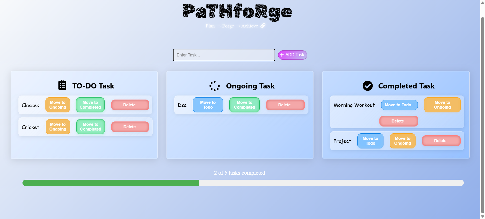

# PathForge  
**Plan • Forge • Achieve**  

A simple and visually appealing task management app built with **React + Vite**.  
Organize your tasks into **To Do, On-Going, and Completed** sections with smooth UI, progress tracking, and icon-enhanced buttons.  

---

## 🚀 Features  
- 📋 Task sections: To Do, On-Going, Completed  
- ➕ Add tasks with a clean input + plus icon  
- ✅ Mark tasks as completed  
- 🔄 Move tasks between sections  
- 📊 Progress tracker to visualize completion  
- 🎨 Modern UI with shadows, transitions, and icons  

---

## 🖼️ Demo Screenshot  
  

---

## 🛠️ Tech Stack  
- [React](https://react.dev/)  
- [Vite](https://vitejs.dev/)  
- [React Icons](https://react-icons.github.io/react-icons/)  
- [CSS]   

---

🚀 **Live Demo:** [Click here](https://path-forge-theta.vercel.app/)

---

## ⚡ Getting Started  

### Installation  
Clone the repository and install dependencies:  

git clone https://github.com/your-username/pathforge.git

cd pathforge

npm install

npm run dev
App will run at: http://localhost:5173
